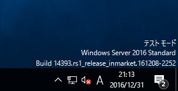
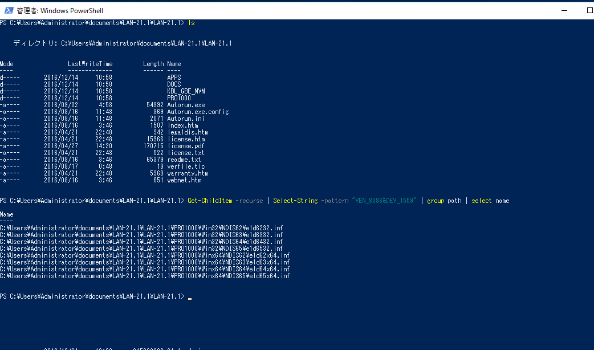
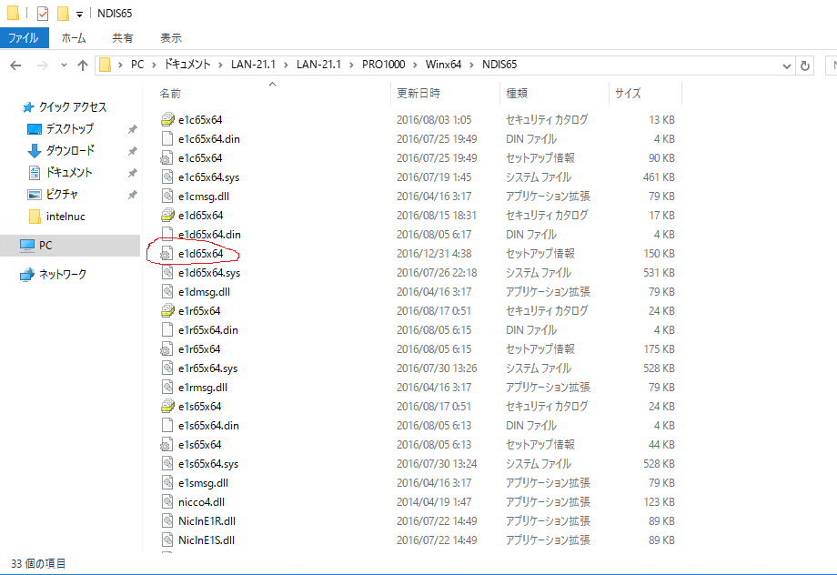
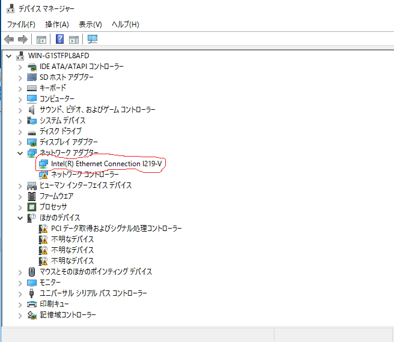

# WindowsServer2016インストール後のNIC未認識トラブル解消方法

最終更新日: 2016/12/31
====

Overview

## Description
この文書は、Windows Server 2016へのDockerコンテナ構築テストを行うため、
Intel NIC6i5SYKモデルにWindowSerer2016を導入した際、NICが認識されずネットワーク接続ができなかった問題を解決した手順である。
参考には次のページの情報を参考にした。

-[Intel NUC(NUC6i5SYH)にWindowsServer2016を入れた際にネットワークに接続できない問題を直す(http://blog.sorceryforce.net/?p=1540)
-[Intel NUCにWindows Serer 2016 TP4の導入とNICドライバ設定あれこれ](https://blogs.msdn.microsoft.com/miyamam/2016/02/12/intel-nuc-%E3%81%ABwindows-server-2016-tp4-%E3%81%AE%E5%B0%8E%E5%85%A5%E3%81%A8nic%E3%83%89%E3%83%A9%E3%82%A4%E3%83%90%E3%81%AE%E8%A8%AD%E5%AE%9A%E3%81%82%E3%82%8C%E3%81%93%E3%82%8C/)


## １．管理者権限でコマンドプロンプトを起動する。
NUCにログインし、管理者権限で起動します。


## ２．OSをテストモードにする。
認識されていないドライバーを強制的にインストール可能とするため、コマンドプロンプトでテストモードにします。
````
C:\>bcdedit /set LOADOPTIONS DISABLE_INTEGRITY_CHECKS
C:\>bcdedit /set TESTSIGNING ON
C:\>bcdedit /set nointegritychecks ON
````
入力後、OSを再起動します。すると右下にテストモードと表示されます。


## ３．最新のNUCドライバをダウンロードします。（私はIntelのサイトからをLAN-21.zipをダウンロードしました。）
私は、これをダウンロードして使用しました。
-[Intel NUC用 LANドライバ](https://downloadcenter.intel.com/ja/downloads/eula/26481/-NUC7i-x-bn-?httpDown=https%3A%2F%2Fdownloadmirror.intel.com%2F26481%2Feng%2FLAN-21.1.zip)
ダウンロードしたファイルをUSBメモリで設定する、Windows Serer2016に入れ任意のフォルダで解凍します。

## 認識していないイーサネットコントローラの確認をします。
NUCのデバイスマネージャを起動します。（Windows右クリック→デバイスマネージャ）
イーサネットコントローラのツリーを右クリックでプロパティを開き、詳細タブでプロパティにハードウェアIDを選択します。

## ４．Power Shellを起動し、３．で解凍したフォルダに移動してドライバを探します。

Intel NUC(NUC6i5SYK)の場合は、Windows10およびWindows2016用のドライバのインストール用の情報はe1d65x64.infにありました。
このe1d65x64.infファイルをテキストエディタ等で下記の編集を行いました。


[ControlFlags]以下を";"を使ってコメントアウトします。
````
[ControlFlags]
;ExcludeFromSelect = \ 
;    PCI\VEN_8086&DEV_153A,\ 
;    PCI\VEN_8086&DEV_153B
````
[Intel.NTand64.10.0.1]以下の下記の行をコピーし、[Intel.NTand64.10.0]以下の記述の最後尾に貼り付けます。
````
%E153ANC.DeviceDesc%            = E153A.10.0.1,       PCI\VEN_8086&DEV_153A
%E153ANC.DeviceDesc%            = E153A.10.0.1,       PCI\VEN_8086&DEV_153A&SUBSYS_00008086
%E153ANC.DeviceDesc%            = E153A.10.0.1,       PCI\VEN_8086&DEV_153A&SUBSYS_00011179
%E153BNC.DeviceDesc%            = E153B.10.0.1,       PCI\VEN_8086&DEV_153B
%E153BNC.DeviceDesc%            = E153B.10.0.1,       PCI\VEN_8086&DEV_153B&SUBSYS_00008086
%E153BNC.DeviceDesc%            = E153B.10.0.1,       PCI\VEN_8086&DEV_153B&SUBSYS_00011179
%E155ANC.DeviceDesc%            = E155A.10.0.1,       PCI\VEN_8086&DEV_155A
%E155ANC.DeviceDesc%            = E155A.10.0.1,       PCI\VEN_8086&DEV_155A&SUBSYS_00008086
%E155ANC.DeviceDesc%            = E155A.10.0.1,       PCI\VEN_8086&DEV_155A&SUBSYS_00011179
%E1559NC.DeviceDesc%            = E1559.10.0.1,       PCI\VEN_8086&DEV_1559
%E1559NC.DeviceDesc%            = E1559.10.0.1,       PCI\VEN_8086&DEV_1559&SUBSYS_00008086
%E1559NC.DeviceDesc%            = E1559.10.0.1,       PCI\VEN_8086&DEV_1559&SUBSYS_00011179
%E15A0NC.DeviceDesc%            = E15A0.10.0.1,       PCI\VEN_8086&DEV_15A0
%E15A0NC.DeviceDesc%            = E15A0.10.0.1,       PCI\VEN_8086&DEV_15A0&SUBSYS_00008086
%E15A1NC.DeviceDesc%            = E15A1.10.0.1,       PCI\VEN_8086&DEV_15A1
%E15A1NC.DeviceDesc%            = E15A1.10.0.1,       PCI\VEN_8086&DEV_15A1&SUBSYS_00008086
%E15A2NC.DeviceDesc%            = E15A2.10.0.1,       PCI\VEN_8086&DEV_15A2
%E15A2NC.DeviceDesc%            = E15A2.10.0.1,       PCI\VEN_8086&DEV_15A2&SUBSYS_00008086
%E15A2NC.DeviceDesc%            = E15A2.10.0.1,       PCI\VEN_8086&DEV_15A2&SUBSYS_00011179
%E15A3NC.DeviceDesc%            = E15A3.10.0.1,       PCI\VEN_8086&DEV_15A3
%E15A3NC.DeviceDesc%            = E15A3.10.0.1,       PCI\VEN_8086&DEV_15A3&SUBSYS_00008086
%E15A3NC.DeviceDesc%            = E15A3.10.0.1,       PCI\VEN_8086&DEV_15A3&SUBSYS_00011179
%E156FNC.DeviceDesc%            = E156F.10.0.1,       PCI\VEN_8086&DEV_156F
%E156FNC.DeviceDesc%            = E156F.10.0.1,       PCI\VEN_8086&DEV_156F&SUBSYS_00008086
%E156FNC.DeviceDesc%            = E156F.10.0.1,       PCI\VEN_8086&DEV_156F&SUBSYS_00011179
%E1570NC.DeviceDesc%            = E1570.10.0.1,       PCI\VEN_8086&DEV_1570
%E1570NC.DeviceDesc%            = E1570.10.0.1,       PCI\VEN_8086&DEV_1570&SUBSYS_00008086
%E1570NC.DeviceDesc%            = E1570.10.0.1,       PCI\VEN_8086&DEV_1570&SUBSYS_00011179
%E15B7NC.DeviceDesc%            = E15B7.10.0.1,       PCI\VEN_8086&DEV_15B7
%E15B7NC.DeviceDesc%            = E15B7.10.0.1,       PCI\VEN_8086&DEV_15B7&SUBSYS_00008086
%E15B7NC.DeviceDesc%            = E15B7.10.0.1,       PCI\VEN_8086&DEV_15B7&SUBSYS_00011179
%E15B8NC.DeviceDesc%            = E15B8.10.0.1,       PCI\VEN_8086&DEV_15B8
%E15B8NC.DeviceDesc%            = E15B8.10.0.1,       PCI\VEN_8086&DEV_15B8&SUBSYS_00008086
%E15B8NC.DeviceDesc%            = E15B8.10.0.1,       PCI\VEN_8086&DEV_15B8&SUBSYS_00011179
%E15B9NC.DeviceDesc%            = E15B9.10.0.1,       PCI\VEN_8086&DEV_15B9
%E15B9NC.DeviceDesc%            = E15B9.10.0.1,       PCI\VEN_8086&DEV_15B9&SUBSYS_00008086
%E15B9NC.DeviceDesc%            = E15B9.10.0.1,       PCI\VEN_8086&DEV_15B9&SUBSYS_00011179
%E15D7NC.DeviceDesc%            = E15D7.10.0.1,       PCI\VEN_8086&DEV_15D7
%E15D7NC.DeviceDesc%            = E15D7.10.0.1,       PCI\VEN_8086&DEV_15D7&SUBSYS_00008086
%E15D7NC.DeviceDesc%            = E15D7.10.0.1,       PCI\VEN_8086&DEV_15D7&SUBSYS_00011179
%E15D8NC.DeviceDesc%            = E15D8.10.0.1,       PCI\VEN_8086&DEV_15D8
%E15D8NC.DeviceDesc%            = E15D8.10.0.1,       PCI\VEN_8086&DEV_15D8&SUBSYS_00008086
%E15D8NC.DeviceDesc%            = E15D8.10.0.1,       PCI\VEN_8086&DEV_15D8&SUBSYS_00011179
%E15E3NC.DeviceDesc%            = E15E3.10.0.1,       PCI\VEN_8086&DEV_15E3
%E15E3NC.DeviceDesc%            = E15E3.10.0.1,       PCI\VEN_8086&DEV_15E3&SUBSYS_00008086
%E15E3NC.DeviceDesc%            = E15E3.10.0.1,       PCI\VEN_8086&DEV_15E3&SUBSYS_00011179
%E15D6NC.DeviceDesc%            = E15D6.10.0.1,       PCI\VEN_8086&DEV_15D6
%E15D6NC.DeviceDesc%            = E15D6.10.0.1,       PCI\VEN_8086&DEV_15D6&SUBSYS_00008086
%E15D6NC.DeviceDesc%            = E15D6.10.0.1,       PCI\VEN_8086&DEV_15D6&SUBSYS_00011179

````

## ５．４で編集したINFファイルを右クリックし、インストールするとドライバの認識がされます。
最終的にデバイスマネージャから見ると以下の様になります。


## ６．テストモードを終了するため以下のコマンドを実行し、OSを再起動します。
````
C:\>bcdedit /set LOADOPTIONS ENABLE_INTEGRITY_CHECKS
C:\>bcdedit /set TESTSIGNING OFF
C:\>bcdedit /set nointegritychecks OFF
````

## Contribution

## Licence

[MIT](https://github.com/tcnksm/tool/blob/master/LICENCE)

## Author

[fuguman](https://github.com/fuguman)
